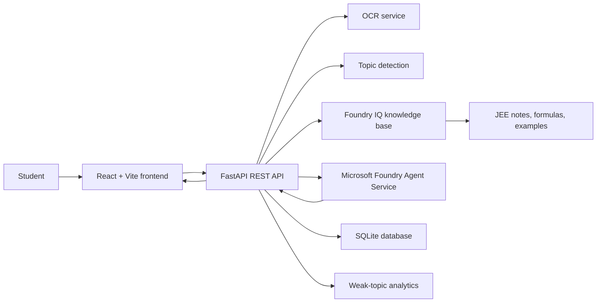

# Architecture

## Runtime Flow

1. Student submits a typed or image-based JEE question.
2. FastAPI extracts text if an image is uploaded.
3. Topic detection returns `subject`, `topic`, and `confidence_score`.
4. Foundry IQ retrieves relevant formulas, notes, and solved examples with citations.
5. Microsoft Foundry Agent Service receives the question plus retrieved context and produces a grounded step-by-step solution.
6. The backend stores the question, detected topic, citations, and performance signals in SQLite.
7. The frontend displays the solution, formulas, citations, similar questions, history, and analytics.
